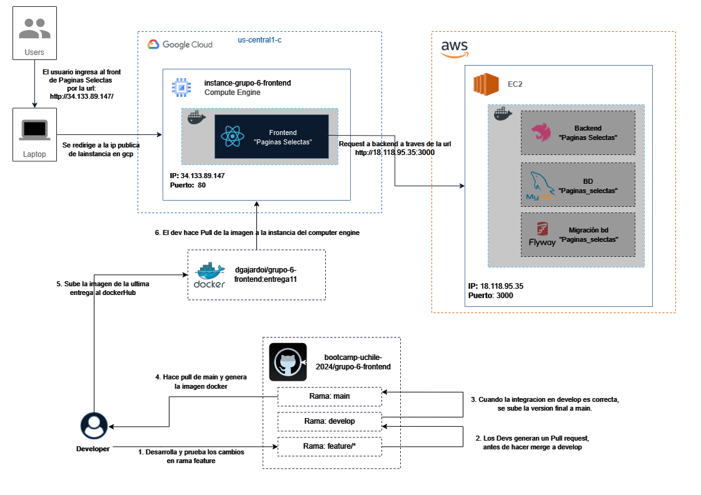
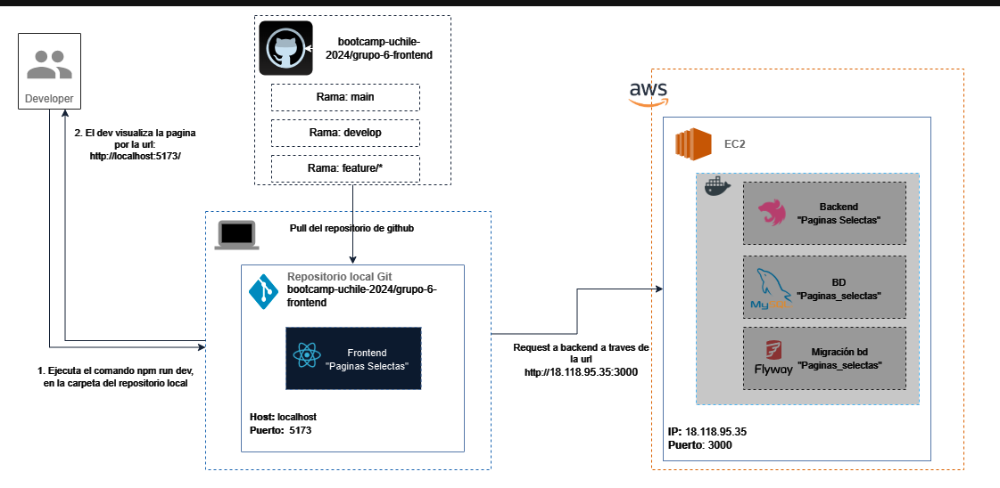

# Arquitectura de la solución

## Descripción General
Esta documentación describe la arquitectura de la aplicación frontend desplegada en una instancia de **Google Compute Engine (GCP)**. La aplicación está expuesta en el puerto 80 de la IP pública `34.133.89.147` y utiliza Docker para ejecutar la imagen `dgajardoi/grupo-6-frontend:entrega11`.

---

## Arquitectura
Se presenta la arquitectura de la aplicación frontend, tanto en su entorno productivo como en el entorno de desarrollo.

### **Diagrama de Arquitectura**
En esta sección se presentan los diagramas de arquitectura de la aplicación frontend, tanto en su entorno productivo como en el entorno de desarrollo.
#### Diagrama Productivo
En el entorno productivo, la aplicación frontend se ejecuta en una instancia de **Google Compute Engine**, la cual está expuesta públicamente en el puerto 80. La instancia tiene instalado Docker y ejecuta la imagen `dgajardoi/grupo-6-frontend:entrega11` para desplegar la aplicación frontend. En el caso del backend, se ejecuta en una instancia de **Amazon EC2** y se expone en el puerto 3000. La base de datos se despliega en un contenedor Docker en la instancia de Amazon EC2 y se expone en el puerto 3306.


#### Diagrama Dev
En el entorno de desarrollo, la aplicación **frontend** se ejecuta en la **maquina local** del desarrollador y se expone en la url `http://localhost:5173`. La aplicación **backend** se ejecuta en una instancia de **Amazon EC2** y se expone en el puerto 3000. La base de datos se despliega en un contenedor Docker en la instancia de Amazon EC2 y se expone en el puerto 3306.




## Componentes
En esta sección se describen los componentes de la aplicación frontend en su entorno productivo.

### **Frontend Producción**
#### **Instancia de Google Compute Engine**
- **Proveedor**: Google Cloud Platform (GCP).
- **Tipo de instancia**: Compute Engine.
- **Sistema Operativo**: Basado en Linux (Debian/Ubuntu recomendado).
- **IP Pública**: `34.133.89.147`.
- **Puerto Abierto**: `80` (para HTTP).
- **Firewall**: Configurado para permitir tráfico entrante en el puerto `80`.

---

#### **Docker**
Se encuentra en la instancia de Computer Engine de GCP y se utiliza para ejecutar el frontend de la aplicación.
- **Rol**: Herramienta de contenedorización utilizada para ejecutar la aplicación frontend.
- **Imagen utilizada**: `dgajardoi/grupo-6-frontend:entrega11`.
- **Configuración del contenedor**:
  - Puerto interno: `80`.
  - Puerto externo: `80`.
  - Comando de ejecución: 
    ```bash
    docker run -d -p 80:80 dgajardoi/grupo-6-frontend:entrega11
    ```

---

#### **Flujo de Despliegue**
1. **Preparación de la instancia**:
   - Configuración inicial de la instancia en GCP.
   - Instalación de Docker en la instancia:
     ```bash
     sudo apt update
     sudo apt install -y docker.io
     sudo systemctl start docker
     ```

2. **Ejecución de la imagen Docker**:
   - Pull de la imagen desde Docker Hub:
     ```bash
     docker pull dgajardoi/grupo-6-frontend:entrega11
     ```
   - Ejecución del contenedor:
     ```bash
     docker run -d -p 80:80 dgajardoi/grupo-6-frontend:entrega11
     ```

3. **Acceso a la aplicación**:
   - La aplicación está accesible públicamente desde cualquier navegador mediante la URL:
     ```
     http://34.133.89.147
     ```

---
### **Frontend Desarrollo**
#### **Maquina Local**
- **Sistema Operativo**: Windows.
- **Puerto Abierto**: `5173` (para HTTP).
- **Firewall**: Configurado para permitir tráfico entrante en el puerto `5173`.

#### Flujo de despliegue
1. **Preparación de la máquina local**:
   - Descarga de dependencias.
    ```bash
    npm install
    ```
   - Ejecución de la aplicación.
    ```bash
    npm run dev
    ```

### **Backend Producción y Desarrollo**
En el caso del backend actualmente se utiliza la misma instancia para probar desde frontend para desarrollo y producción. El backend se ejecuta en una instancia de **Amazon EC2** y se expone en el puerto 3000. La base de datos se despliega en un contenedor Docker en la instancia de Amazon EC2 y se expone en el puerto 3306.

**Nota**: Antes de que existiera la instancia de EC2, el backend se ejecutaba en la máquina local del desarrollador y se exponía en el puerto 3000. La base de datos se desplegaba en un contenedor Docker en la máquina local del desarrollador y se exponía en el puerto 3306.

#### 1. **Instancia de Amazon EC2**
- **Proveedor**: Amazon Web Services (AWS).
- **Tipo de instancia**: EC2 (t2.micro o superior según necesidad).
- **Sistema Operativo**: Amazon Linux 2 o Ubuntu.
- **IP Pública**: `18.118.95.35`.
- **Puertos Abiertos**:
  - `3000` (para el backend NestJS).
- **Seguridad**:
  - Grupo de seguridad configurado para permitir tráfico en los puertos mencionados.

---
#### 2. **Docker**
Se encuentra en la instancia de Amazon EC2 y se utiliza para ejecutar el backend de la aplicación.
- **Rol**: Herramienta de contenedorización utilizada para ejecutar:
  - **Backend (NestJS)**: Aplicación principal de la solución.
  - **MySQL**: Base de datos con todas las tablas y datos necesarios.
  - **Flyway**: Migraciones de la base de datos.
- **Configuración del Contenedor**:
  - Los contenedores están orquestados en una red Docker interna para permitir la comunicación entre ellos.

---
